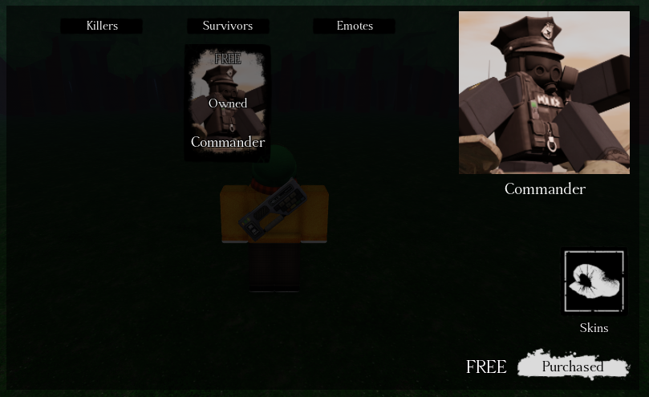
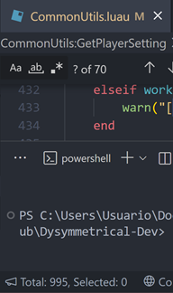

# DYSYMMETRICAL

An asymmetrical game engine for Roblox.

## Features

#### Full documentation in most scripts

#### Easy UI Ordering in a single table

#### Simple character definitions & Templates for each role
For these templates, the animations will have to be replaced as the ones they have are owned by CodeBots.

[...]

#### Pre-made customizable UI

#### 1K+ lines of documented utils in ReplicatedStorage

## Getting Started
First of all, install [Rojo](https://rojo.space/docs/v7/getting-started/installation/).

It's essential for anyone to work properly with this project and even keep it up-to-date.
It's not mandatory, but it's heavily recommended.

It's also necessary that you know how to code. Yup, had to use that card.

There's an example place included in the repository, which you can duplicate and rename to use for your own project.
It is needed, though, to keep the place inside of the repository and never remove it so that merging with updates to the engine is a lot easier and faster.

Make sure to replace the animations in the template characters.

## Documentation
Docs for anything added in the engine can be found through code comments at the start of important variables or functions. Any of those that isn't considered important outside of being used internally doesn't have any.

A proper docs page may be made if the project gets too big.

No one's stopping anyone from reading the code by themselves and changing it, though.

## Contributing
Contributing's such a simple topic that it isn't in its own separate file.

You may create pull requests of anything you want changed from the engine as long as it benefits anyone (e.g. a QoL feature or a bug fix).

They will be read and checked to see if they deserve to be merged.

To-Do's are listed through comments as well, so you might want to isntall something like [Todo+](https://marketplace.visualstudio.com/items?itemName=fabiospampinato.vscode-todo-plus) in VSCode to see every `NOTE`, `FIXME`, `TODO`...

If you *do* indeed make a pull request, it'll most probably be revised and merged without many questions or complaints.
Though, if it's needed, the stuff in the pull requests will be changed if it doesn't comply with W.I.P. features or with the code style itself.

## Licensing
You may use this project for whatever you want, as long as you keep credit.
Do NOT remove the `print()` calls that identify this engine.

Also see [GNU GPL-3.0 License](https://www.gnu.org/licenses/gpl-3.0.html).
